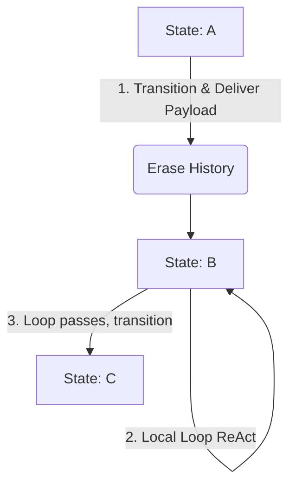
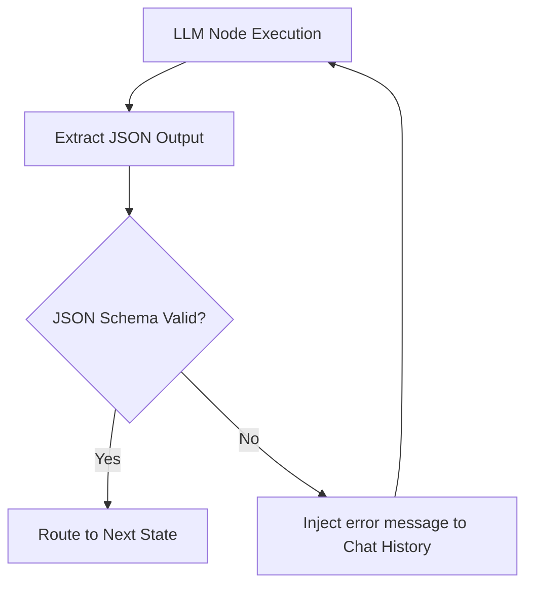

> 此 README 为 LLM 自行生成，后续会更新人工版本。

# LangGraph Skills

本项目是一个基于 Markdown Skills 和 LangGraph 实现的，可以以近似 Markdown Skills 语法实现轻量级 LLM Agent 状态机的小型解释器项目。它能够将人类用 Markdown 编写的低耦合、非结构化 Agent 行为描述草稿（Draft Skills），编译标准化为具有严谨控制流的标准 Markdown AST 状态机（Compiled Skills），并通过 LangGraph 引擎动态生成和执行复杂的 Agent 拓扑结构。

其最初的灵感源于重构类似于 [_archive/agent_v2.py](_archive/agent_v2.py) 这种充斥着硬编码逻辑、对话历史污染和 Mypy 校验重试逻辑的传统 Python Agent 脚本。通过本项目，复杂的编程助手已被完全抽象并用声明式的 Markdown Skill [assistant_compiled.md](assistant_compiled.md) 代替。

---

## 🚀 核心特性

1. **零硬编码的动态图引擎**：
   - 将 Markdown 状态机解析为 IR（[parser.py](langgraph_skills/parser.py) + [models.py](langgraph_skills/models.py)），在运行时动态注册 LangGraph 节点和跳转边，无需针对特定任务重新硬编码 Python Graph 代码。

2. **JSON Schema 校验与自修复自愈 (Self-Healing)**：
   - 在状态节点内通过 `## [Output JSON]` 声明交付物数据规范。在转移跳转前自动使用 `jsonschema` 对交付 Payload 进行格式和完整度检查。若验证失败，自动将错误原因反向注入 Payload 并退回原节点，促使大模型自我修正。

3. **动态工具注册、解耦与 ReAct 运行时**：
   - 支持全局 `# [Tools]` 块声明，支持外部脚本（`type: script`）和 API 接口（`type: api`）。
   - **动态工具解耦扫描**：解释器在启动时会自动扫描工作目录及 Skill 同级目录下的 `tools/` 目录，动态加载其中所有使用 LangChain `@tool` 装饰器定义的 Python 工具。
   - **内置工具覆盖**：如果加载的自定义工具名与内置工具（如 `web_search`）同名，自定义工具会自动覆盖并替换系统默认工具，方便用户无缝集成生产级真实工具。


4. **人工审批门 (Human-in-the-Loop Gate)**：
   - 在关键跳转上声明人工审批属性（如表格中 `Require Approval` 列填 `yes`，或列表式跳转中使用 `[Require Approval]` 标记）。转移时终端交互式挂起，向人类展示交付内容。支持输入 `y` 确认放行，或直接在终端输入拒绝理由退回节点，驱动 AI 进行修正。

5. **嵌套子图调用 (Sub-graph Skill Execution)**：
   - 支持定义 `type: skill` 的嵌套节点。解释器将自动挂起当前图并递归流转子图。子图流转完成后，其 deliverables payload 将无缝继承回父图上下文。

6. **对话历史自动切片隔离 (Anti-Prompt Pollution)**：
   - 彻底解决了状态跳转时的 prompt 污染问题。只有在状态内自循环（如交互对话、类型纠错循环）时保留消息历史；一旦发生状态节点流转，立即自动启动新会话，只携带 System Prompt 与上游 Payload。

---

## 📂 项目结构描述

以下是完整的项目文件结构树及其详细功能说明：

```
langraph_skills/
├── pyproject.toml                     # 项目标准打包配置文件（包含依赖及 CLI 命令映射）
├── requirements.txt                   # 核心第三方依赖库列表
├── README.md                          # 项目核心说明文档（本文件）
├── PROCESS.md                         # 项目维护流程（SOP）：变更步骤、工具清单、质量门
├── skill_syntax_guide.md              # Skills DSL 语法指南（由 spec 生成的参考版 + 人工定稿）
├── bootstrap_compiled.md              # 自举编译器 Skill（带 lgskills Shebang，可直跑）
├── langgraph.json                     # LangGraph Studio 集成配置
├── studio_app.py                      # LangGraph Studio 入口（导出 graph 变量）
├── mypy_check.py                      # 编程助手/审查器运行 mypy 时调用的外部校验脚本
├── test_broken.py                     # 用于审查器自修复测试的“破损” Python 代码
│
├── langgraph_skills/                  # 核心 Python 源代码包
│   ├── __init__.py                    # 包初始化，暴露核心版本与接口
│   ├── __main__.py                    # 模块入口，支持 python -m langgraph_skills
│   ├── cli.py                         # 唯一 CLI 入口，分发 compile/validate/run 子命令
│   ├── config.py                      # 引擎配置（Settings + 密钥解析 + LGSKILLS_* 环境变量）
│   ├── models.py                      # IR 数据模型（CompiledSkill / StateInfo / Transition 等）
│   ├── parser.py                      # 前端解析器：Markdown -> IR（含校验 validate_state_graph）
│   ├── tools.py                       # 工具注册表（每图隔离）+ 内置工具 + 工具工厂
│   ├── executors.py                   # 节点执行器（llm/code/script/skill，可插拔注册表）
│   ├── nodes.py                       # 节点工厂 + 路由器（create_state_node / generic_router / tool_router）
│   ├── graph.py                       # 图构建层（build_graph：IR -> LangGraph，print_help）
│   ├── runner.py                      # 运行时编排 + CLI（run_skill / run_cli / safe_input）
│   └── compiler.py                    # 调用 LLM 进行 Loose 语法标准化的编译器核心逻辑
│
├── spec/                              # DSL 唯一真相源（Single Source of Truth）
│   ├── dsl_spec.yaml                  # 机器可读的 DSL 语法规范
│   └── examples/                      # 金标准示例（.md + .ir.json，锁死 parser 行为）
│
├── scripts/                           # 生成与工具脚本
│   ├── gen_docs.py                    # spec -> 参考文档（skill_syntax_guide.md）
│   ├── gen_compiler_prompt.py         # spec -> COMPILER_PROMPT
│   └── dump_ir.py                     # parser -> IR 快照（金标准初稿生成）
│
├── tests/                             # 单元测试与金标准测试
│   └── test_golden_examples.py        # 金标准示例 round-trip 测试
│
├── test_skills/                       # 测试与演示 Skills 目录（全部为现行 # [State] 语法）
│   ├── sample_skill.md                # 基础顺序/条件自动跳转测试草稿
│   ├── test_compiled.md               # 编译后的标准 sample 技能
│   ├── loop_skill.md                  # 文章草稿多轮循环修改测试
│   ├── loop_compiled.md               # 编译后的文章草稿多轮循环修改技能
│   ├── game_skill.md                  # 猜数字游戏测试（含 python code 状态节点）
│   ├── game_compiled.md               # 编译后的猜数字游戏技能
│   ├── table_skill.md                 # 复杂 Markdown 表格跳转测试
│   ├── table_compiled.md              # 编译后的表格跳转技能
│   ├── test_json_skill.md             # JSON Schema 自动校验与自修复测试技能
│   ├── test_tools_skill.md            # 外部动态工具调用测试技能
│   ├── test_approval_skill.md         # 审批门交互拦截测试技能
│   ├── test_nested_skill.md           # 嵌套子图调用测试技能
│   ├── test_custom_loading.md         # 动态 tools/ 目录加载测试技能
│   ├── info_searcher_draft.md         # 信息搜索 Agent 草稿
│   ├── info_searcher_compiled.md      # 编译后的信息搜索 Agent
│   ├── mock_script_tool.py            # 工具调用测试所依赖的外部模拟脚本
│   ├── test_topic.txt                 # 信息搜索 Agent 的示例输入主题
│   └── tools/                         # 动态工具扫描目录（@tool 装饰器）
│
├── assistant_draft.md                 # 编程助手 Agent 设计草稿
├── assistant_compiled.md              # 编译后的编程助手 Agent（带 mypy 自修复闭环）
├── code_reviewer_compiled.md          # 编译后的智能代码审查与 mypy 修复器
└── _archive/                          # 已归档的遗留文件（被 .gitignore 忽略，不入库）
```

---

## 🛠️ 核心文件与模块解析

### 1. 核心运行库 (python package)
* **[pyproject.toml](pyproject.toml)**：
  定义了包依赖与构建信息，并将 `lgskills` 命令行工具映射到 [cli.py](langgraph_skills/cli.py) 的 `main()` 函数。
* **[cli.py](langgraph_skills/cli.py)**：
  唯一的命令行入口，路由 `compile` / `validate` / `run` 三个子命令。为支持 Shebang 直跑，具备智能回退机制：若首个参数不是保留子命令但以 `.md` 结尾（或该文件存在），自动重定向至 `run`。
* **[models.py](langgraph_skills/models.py)**：
  IR 数据模型（与 AST 合一）。定义 `CompiledSkill` / `StateInfo` / `Transition` / `ToolInfo` / `InputOption` 及运行时 `AgentState`，并统一序列化逻辑（金标准快照）。
* **[parser.py](langgraph_skills/parser.py)**：
  前端解析器，将 Markdown 状态机解析为 `CompiledSkill`。包含顶层 section 切块、`# [State]` 状态体解析、Transitions 表格/列表解析、IO 保留参数生成、`validate_state_graph` 静态校验，以及未知 section 的容错（默认 warning，strict 模式下升级为 error）。
* **[tools.py](langgraph_skills/tools.py)**：
  每图隔离的工具注册表（`ToolRegistry`）。内置 `web_search` / `read_file` / `write_file`，支持 `# [Tools]` 声明的 script/api 工具工厂（`TOOL_FACTORIES` 可扩展），以及 `tools/` 目录动态加载。
* **[executors.py](langgraph_skills/executors.py)**：
  可插拔的节点执行器注册表（`EXECUTOR_REGISTRY`）：`llm` / `code` / `script` / `skill` 各对应一个执行器，可通过 `register_executor` 扩展新状态类型。`ExecutorContext` 集中注入依赖，预留沙箱/权限扩展点。
* **[nodes.py](langgraph_skills/nodes.py)**：
  节点工厂与路由器。`create_state_node` 生成节点函数（loop 计数、JSON Schema 自愈校验、人工审批门）；`generic_router` / `tool_router` 实现 ReAct 闭环与跨节点跳转。`safe_input` / `run_skill` 由调用方注入，避免循环依赖。
* **[graph.py](langgraph_skills/graph.py)**：
  图构建层。`build_graph` 把 IR 组装为 LangGraph 图（每图独立 `ToolRegistry`），`print_help` 生成 CLI 帮助。
* **[runner.py](langgraph_skills/runner.py)**：
  运行时编排 + CLI。`run_skill` 完整执行一个 skill（解析 -> 构建 -> stream），`run_cli` 处理命令行参数 / stdin 管道 / writer 落盘 / 退出码，`safe_input` 提供交互式输入。
* **[config.py](langgraph_skills/config.py)**：
  引擎配置单一入口。`Settings.from_env()` 读取 `LGSKILLS_MODEL` / `LGSKILLS_BASE_URL` / `LGSKILLS_TEMPERATURE` / `LGSKILLS_STRICT` 环境变量；`get_deepseek_key()` 解析密钥（env / `.env` / 密钥文件）。

### 2. 规范与生成管线
* **[spec/dsl_spec.yaml](spec/dsl_spec.yaml)**：
  DSL 语法的唯一真相源（Single Source of Truth）。文档、编译器提示词、金标准示例均由此生成，杜绝"多处定义、相互漂移"。
* **[scripts/gen_docs.py](scripts/gen_docs.py)**：spec -> 参考版 [skill_syntax_guide.md](skill_syntax_guide.md)（最终文档人工定稿）。
* **[scripts/gen_compiler_prompt.py](scripts/gen_compiler_prompt.py)**：spec -> `COMPILER_PROMPT`（保证 LLM 编译器与 parser 同构）。
* **[tests/test_golden_examples.py](tests/test_golden_examples.py)**：金标准示例 round-trip 测试，锁死 parser 行为。

### 3. 高级实战 Agents (DSL 编写示例)
* **[bootstrap_compiled.md](bootstrap_compiled.md)** (自举编译器)：
  以 Skills DSL 本身编写的编译器。它接收草稿内容，请求大模型生成编译后的状态机，然后通过 Python 代码节点调用 `lgskills validate` 进行语法校验，校验不通过则进入自修复状态，直到语法无误并获得人类审批放行后交付最终的编译后 Markdown 文件。
* **[assistant_compiled.md](assistant_compiled.md)** (类型安全编程助手)：
  一个极具说服力的 Agent。它通过 `## [Output JSON]` 输出生成的 Python 代码，并利用 [mypy_check.py](mypy_check.py) 执行严格的类型检查。如果 Mypy 报错，将自动触发修复路径直至代码零错误，最后写入 `temp_agent_output.py`。
* **[code_reviewer_compiled.md](code_reviewer_compiled.md)** (智能代码审查器)：
  加载指定的 Python 文件（如 [test_broken.py](test_broken.py)），使用 mypy 进行检测后定位错误，由大模型重写并修复，然后回填并重新运行校验。

---

## ⚙️ 核心架构设计

### 1. 无污染上下文隔离模型 (Session Partitioning)
在常规 Agent 开发中，随着轮数增加，Prompt 污染和 Token 消耗呈指数级上升。本项目采用**状态隔离设计**：
* 状态在跳转时，会**擦除**之前状态的旧对话历史（Message History）。
* 新状态节点仅继承全局指令（System Message）、当前节点的局部 Prompt 以及上游状态传递下来的 deliverables 键值对字典（Payload）。
* 只有在状态内自循环（如 LLM 与 Tools 进行 ReAct 交互、或是 JSON Schema 纠错循环）时，才会保留并更新局部对话历史。



### 2. JSON Schema 自修复重试机制 (Self-Healing Loop)
当节点定义了 `## [Output JSON]`，解释器会生成如下的动态验证环路：


该自修复循环会自动限制次数（避免死循环），并在多次失败后优雅地抛出错误或降级转移。

### 3. 编译原理分区架构 (Compiler-style Layering)
系统按语言解释器的功能分区组织，模块边界即推倒边界，依赖单向流动：

```
源文本 ─[parser.py]→ IR(models.py) ─[validator]→ 校验后 IR ─[graph.py/build_graph]→ LangGraph ─[executors.py]→ 执行
```

* **前端（parser.py + models.py）**：Markdown -> 结构化 IR，纯文本到数据的转换，可独立测试。
* **执行器（executors.py）**：节点类型 -> 执行函数，可插拔注册（新增状态类型不改核心）。
* **工具（tools.py）**：每图隔离的 `ToolRegistry`，嵌套 skill 互不污染。
* **配置（config.py）**：引擎参数统一入口，环境变量可覆盖。

### 4. DSL 单一真相源 (Spec-driven)
DSL 语法以 [spec/dsl_spec.yaml](spec/dsl_spec.yaml) 为唯一权威定义，文档、编译器提示词、金标准测试均由它生成：

```
dsl_spec.yaml ──gen_docs.py─────────────→ skill_syntax_guide.md（参考版，最终人工定稿）
             └──gen_compiler_prompt.py──→ COMPILER_PROMPT（LLM 编译器与 parser 同构）
             └──金标准示例────────────────→ tests/test_golden_examples.py（锁死 parser 行为）
```

### 5. 环境无关 Shebang 运行原理
通常的脚本直跑需要强绑定 Python 路径。我们通过对 `lgskills` 进行全局 CLI 包注册，支持在 Markdown 文件头部放置：
```markdown
#!/usr/bin/env lgskills
```
配合 [cli.py](langgraph_skills/cli.py) 的首个参数存在性与 `.md` 匹配的 fallback 机制，可以让用户直接把 `.md` 文件当成二进制文件进行执行。

---

## 🛠️ 快速开始

### 1. 安装项目

请在当前工作区的根目录（即本项目的根目录）下运行：

```bash
# 使用 Conda 环境下的 pip 进行本地开发模式（Editable）安装
pip install -e .
```

该命令将自动在您的 Python 环境中注册全局命令 `lgskills`。

**可选依赖**：
* 运行编程助手 / 代码审查等 Agent（依赖 `mypy` 做类型检查）：`pip install -e ".[agents]"`
* 本地开发（测试/lint）：`pip install -e ".[dev]"`

### 2. 配置秘钥与环境变量

运行时系统会依次从以下三个渠道加载 DeepSeek API 秘钥：
1. 系统环境变量：`DEEPSEEK_API_KEY`
2. 当前目录下的 `.env` 文件
3. 由 `DEEPSEEK_API_KEY_FILE` 环境变量指定的密钥文件（路径支持 `~` 展开）

参考 [.env.example](.env.example) 配置您的秘钥。

### 3. 命令行命令参考

#### 3.1 编译草稿
```bash
lgskills compile <draft_path> [output_path]
```
*示例*：将编程助手草稿编译为标准版：
```bash
lgskills compile assistant_draft.md assistant_compiled.md
```

#### 3.2 静态语法校验
```bash
lgskills validate <compiled_path>
```
*示例*：静态检验自举编译器语法：
```bash
lgskills validate bootstrap_compiled.md
```

#### 3.3 运行状态机
```bash
lgskills run <compiled_path> [initial_input] [--input_path file.py]
```
*示例*：直接运行猜数字游戏：
```bash
lgskills run test_skills/game_compiled.md "Start a guessing game."
```

#### 3.4 Shebang 脚本式直接运行
赋予执行权限后直接执行编译后的 Skill 脚本：
```bash
chmod +x bootstrap_compiled.md
./bootstrap_compiled.md --input_path assistant_draft.md --output_path test_skills/assistant_compiled.md
```

---

## 🎯 最佳实践指南

1. **避免在代码节点中硬编码文件操作**：
   在编写例如代码审查、文本分析等 Skill 时，应优先在顶层 `# [IO]` 中声明 `- **reader**: txt_reader` 和 `- **writer**: txt_writer`。这会使 Skill 的读写流程标准化，解耦底层存储，运行命令时可通过 `--input_path` 与 `--output_path` 动态传入真实文件。
2. **谨慎管理交互标志 (`interactive`)**：
   对于需要跟用户对话的节点，开启 `interactive: true`；对于后台静默运行的数据处理节点，关闭 interactive。
3. **利用嵌套 Skill 组合复杂逻辑**：
   通过 `type: skill` 和 `src: subgraph.md`，您可以将一个复杂的超级 Agent 拆解为多个小型、单一职责的子状态机。
